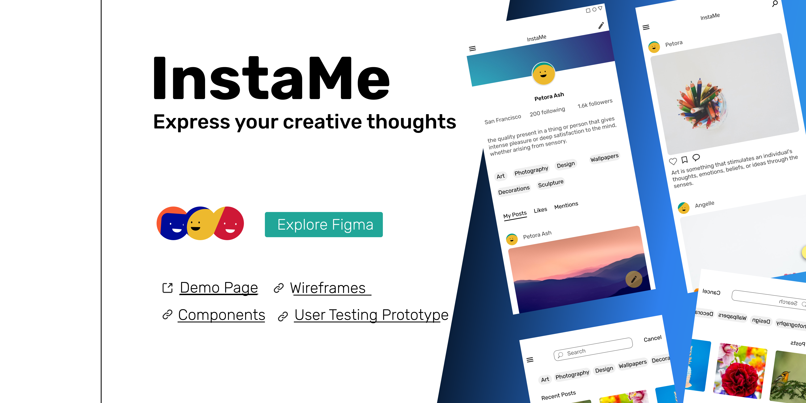
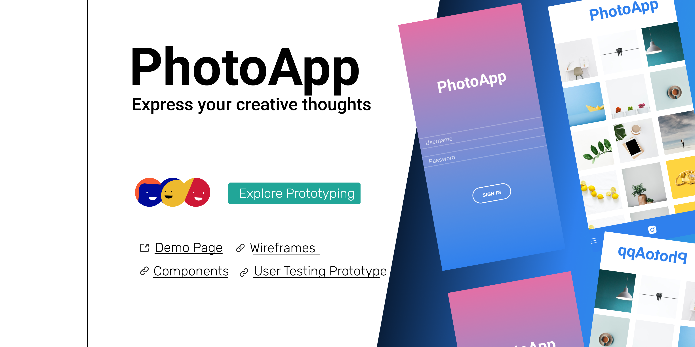
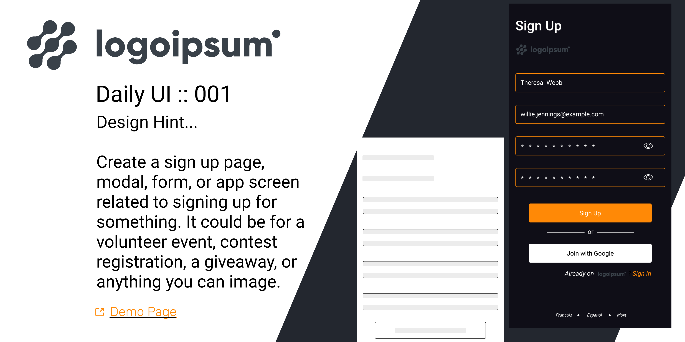
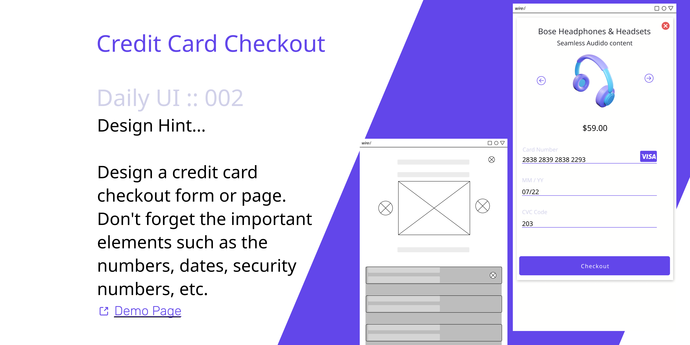
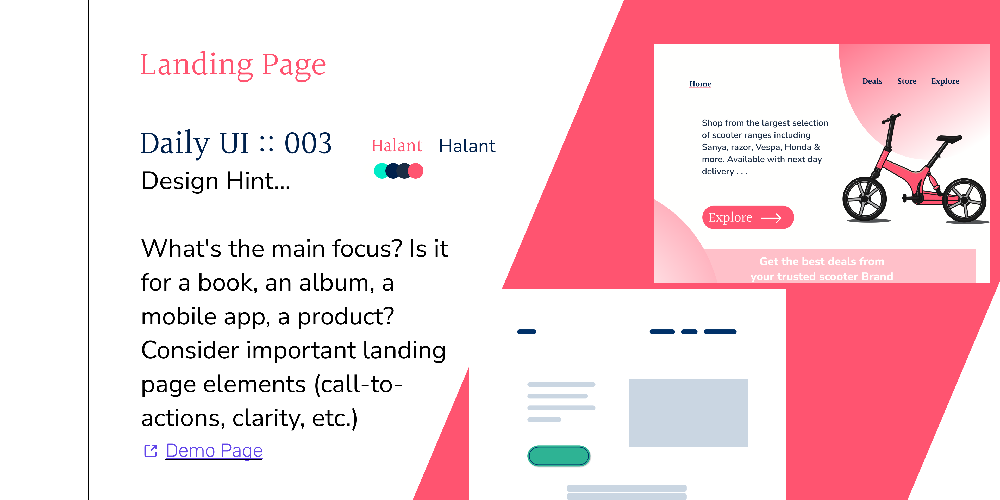
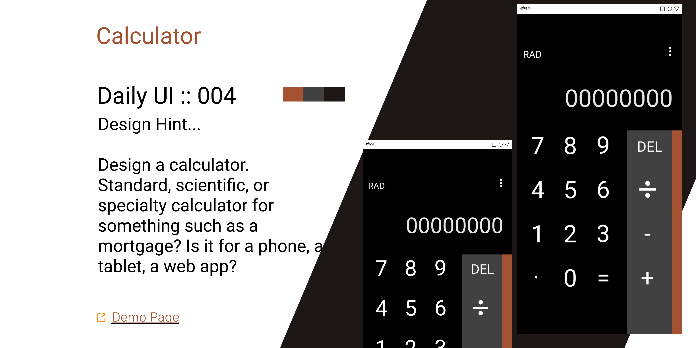

As the usage of technology grows by the day, so does the demand for user experience (UX) designers. UX designers are concerned with how users interact with things such as websites, applications, and physical items. Everyday encounters are made more helpful, pleasant, and accessible by UX designers. That is why businesses of all sizes and in a variety of sectors require the services of UX designers. I am thrilled to walk through this journey to become a better UX designer, as I gain the skills necessary to launch a career/product in today's most demand to technology products.

## Exploring Figma

Explore figma use cases

[Demo Page](https://www.figma.com/proto/77OOsodMeRR5v2jWava5XS/Explore-Ideas?node-id=7%3A53&viewport=241%2C48%2C0.78&scaling=scale-down&page-id=7%3A52&starting-point-node-id=7%3A53)

## Design Lab

Express creative thought

[Demo Page](https://www.figma.com/proto/Yu59kYFKqrhHKheOJMXEok/trydesignlab?node-id=6%3A79&viewport=241%2C48%2C0.31&scaling=scale-down&page-id=0%3A1&starting-point-node-id=1%3A2)

## Daily UI :: 001

Design Hint...

Create a sign up page, modal, form, or app screen related to signing up for
something. It could be for a volunteer event, contest registration, a giveaway, or
anything you can image.

[Demo Page](https://www.figma.com/proto/epNwbRzfjz3YaW6U3ejsYa/Daily-UI-::-001?node-id=4%3A27&viewport=241%2C48%2C1&scaling=scale-down&page-id=0%3A1%3Ffuid%3D901914268454600757)

## Daily UI :: 002

Design Hint...

Design a credit card checkout form or page. Don't forget the important elements such as the numbers, dates, security numbers, etc.

[Demo Page](https://www.figma.com/proto/hysPrmu6ODKCRYRfJwTaJt/Daily-UI-::-002?node-id=12%3A27&viewport=241%2C48%2C1&scaling=scale-down&page-id=0%3A1%3Ffuid%3D901914268454600757)

## Daily UI :: 003

Design Hint...

What's the main focus? Is it for a book, an album, a mobile app, a product? Consider important landing page elements (call-to-actions, clarity, etc.)

[Demo Page](https://www.figma.com/proto/seRcwT8zDtyeE2XmGehxzc/Daily-UI-::-003?node-id=5%3A17&viewport=241%2C48%2C0.4&scaling=min-zoom&page-id=0%3A1%3Ffuid%3D901914268454600757)

## Daily UI :: 004

Design Hint...

Design a calculator. Standard, scientific, or specialty calculator for something such as a mortgage? Is it for a phone, a tablet, a web app?

[Demo Page](https://www.figma.com/proto/9v1RHwmqOnTJPihWDypGFb/Daily-UI-::-004?node-id=1%3A2&viewport=241%2C48%2C1&scaling=scale-down&page-id=0%3A1%3Ffuid%3D901914268454600757)
